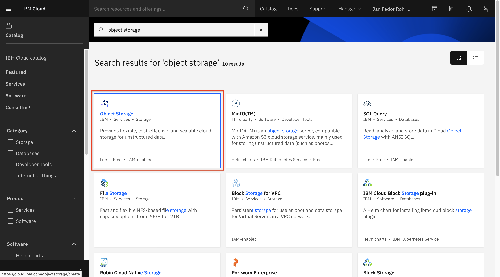
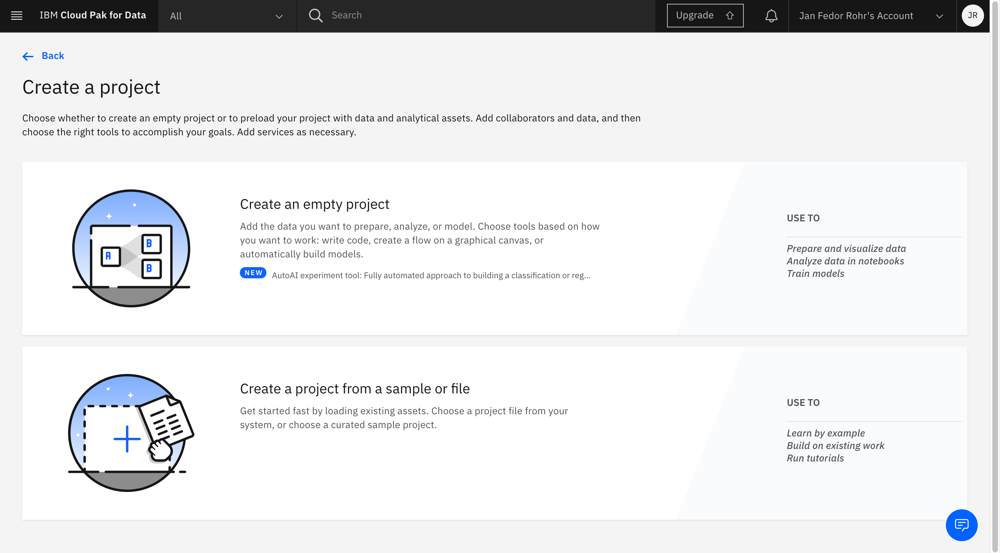

<h1 align="center" style="border-bottom: none;">:bar_chart: IBM Digital Tech Tutorial: Watson Studio</h1>
<h3 align="center">In this hands-on tutorial you will perform data visualization, preparation, and transformation to build high-quality predictive model for customer churn.</h3>

## Prerequisites

1. Sign up for an [IBM Cloud account](https://cloud.ibm.com/registration).
2. Fill in the required information and press the „Create Account“ button.
3. After you submit your registration, you will receive an e-mail from the IBM Cloud team with details about your account. In this e-mail, you will need to click the link provided to confirm your registration.
4. Now you should be able to login to your new IBM Cloud account ;-)

## Set up your environment

<h4>1) Create the Object Storage service</h4>

After the login you will see your IBM Cloud Dashboard. In the upper menu bar click Catalog. In the Catalog section, search for Object Storage. Then, click the Object Storage tile. Enter a name and select the Lite version of the service. Finally, click create.

<h4>2) Create the Watson Studio service</h4>
Repeat the same process for the Watson Studio. You will find it in the Catalog under the category AI or by searching for the term Watson Studio. Enter a name and select the Lite version of the service and a region and click create.

## Create a new Watson Studio project

1. Click on the IBM Cloud logo in the upper left to get back to your dashboard. Then click services to select your Watson Studio service to get started. 
2. In the Watson Studio click either Create a project or New project. Select Create an empty project. 

3. In the New project window, name the project (for example, “Customer Churn Project”).
4. For Storage, you should select the IBM Cloud Object Storage service you created in the previous step. If it is the only storage service that you have provisioned, it is assigned automatically.
5. Click Create.

## Provision IBM Cloud services in Watson Studio

<h4>1) Watson Machine Learning service</h4>
1. Select the Settings tab in the project menu.
2. Scroll down to the Associated services section.
3. Click Add Service.
4. Select Watson from the drop-down menu.
5. On the next page, click Add in the Machine Learning service tile.
6. On the next page, select the New tab to create a new service.
7. Keep the Lite plan for now (you can change it later, if necessary).
8. Scroll down and click Create to create the service.
9. The Confirm Creation window opens, which lets you specify the details of the service such as the region, the plan, the resource group, and the service name.
10. Enter a name for the service instance (optionally, you can prefix the generated name with “watson-machine-learning”). You can keep the default resource group.
11. Click Confirm.

<h4>2) IBM Cognos Dashboard Embedded service</h4>
1. Select the Settings tab again.
2. Scroll to the Associated services section.
3. Click Add service.
4. Select Dashboard from the drop-down menu.
5. On the next page, select New to create a new service.
6. Keep the Lite plan for now (you can change it later, if necessary).
7. Enter a name for the service instance (optionally, you can prefix the generated name with “watson-machine-learning”). You can keep the default resource group.
8. Click Confirm.

Click Create to create the service.

## If you have any questions just contact me
Felix Augenstein 
Digital Tech Ecosystem & Developer Representative @IBM 
Twitter: [@F_Augenstein](https://twitter.com/F_Augenstein) 
LinkedIn: [linkedin.com/in/felixaugenstein](https://www.linkedin.com/in/felixaugenstein/)
