<h1 align="center" style="border-bottom: none;">:bar_chart: IBM Cloud Pak for Data Tutorial: Part I</h1>
<h3 align="center">In this hands-on tutorial you will perform data visualization, preparation, and transformation to build a high-quality predictive model for customer churn.</h3>

## Prerequisites

1. Sign up for an [IBM Cloud account](https://cloud.ibm.com/registration).
2. Fill in the required information and press the „Create Account“ button.
3. After you submit your registration, you will receive an e-mail from the IBM Cloud team with details about your account. In this e-mail, you will need to click the link provided to confirm your registration.
4. Now you should be able to login to your new IBM Cloud account ;-)

## Cloud Pak for Data Tutorials Part I to V

This tutorial consists of 5 parts, you can start with part I or any other part, however, the necessary environment is set up in part I. 
[Part I - data visualization, preparation, and transformation](https://github.com/FelixAugenstein/cloud-pak-for-data-tutorial) 
[Part II - build and evaluate machine learning models by using the AutoAI](https://github.com/FelixAugenstein/cloud-pak-for-data-tutorial-part-ii) 
[Part III - graphically build and evaluate machine learning models by using the SPSS Modeler flow](https://github.com/FelixAugenstein/cloud-pak-for-data-tutorial-part-iii) 
[Part IV - set up and run Jupyter Notebooks to develop a machine learning model](https://github.com/FelixAugenstein/cloud-pak-for-data-tutorial-part-iv) 
[Part V - deploy a local app to test your model](https://github.com/FelixAugenstein/cloud-pak-for-data-tutorial-part-v)

The first 4 parts of this tutorial are based on the [Learning path: Getting started with Watson Studio](https://developer.ibm.com/series/learning-path-watson-studio/).

<h4>1) CRISP-DM</h4>
The **CR**oss **I**ndustry **S**tandard **P**rocess for **D**ata **M**ining is a model to display the cycle of a data science project. It consists of six phases: 
1. Business Understanding - What does the business need? 
2. Data Understanding - What data do we have and how is it made up of? 
3. Data Preparation - How can we structure the data for the modeling? 
4. Modeling - Which modeling techniques could apply? 
5. Evaluation - Which model is the most accurate? 
6. Deployment - How to implement the model? 

In this case we have a business understanding provided (predict churns) and we will focus on getting to understand the data better and prepare it for modeling.

## Set up your environment

<h4>1) Create the Object Storage service</h4>

After the login you will see your IBM Cloud Dashboard. In the upper menu bar click Catalog. In the Catalog section, search for Object Storage. Then, click the Object Storage tile. Enter a name and select the Lite version of the service. Finally, click create.

<h4>2) Create the Watson Studio service</h4>
Repeat the same process for the Watson Studio. You will find it in the Catalog under the category AI or by searching for the term Watson Studio. Enter a name and select the Lite version of the service and a region and click create.

## Create a new Watson Studio project

1. Click on the IBM Cloud logo in the upper left to get back to your dashboard. Then click services to select your Watson Studio service to get started. 
2. In the Watson Studio click either Create a project or New project. Select Create an empty project. In case a "Get started" button appears, click it.

3. In the New project window, name the project (for example, “Customer Churn Project”).
4. For Storage, you should select the IBM Cloud Object Storage service you created in the previous step. If it is the only storage service that you have provisioned, it is assigned automatically.
5. Click Create.

## Provision IBM Cloud services in Watson Studio

<h4>1) Watson Machine Learning service</h4>

1. Select the Settings tab in the project menu. 
2. Scroll down to the Associated services section. 
3. Click Add Service. 
4. Select Watson from the drop-down menu. 
5. On the next page, click Watson Machine Learning service tile. 
6. On the next page, select the New tab to create a new service. 
7. Keep the Lite plan for now (you can change it later, if necessary). 
8. Scroll down and click Create to create the service. 
9. The Confirm Creation window opens, which lets you specify the details of the service such as the region, the plan, the resource group, and the service name. 
10. Enter a name for the service instance. You can keep the default resource group. 
11. Click Confirm. 

<h4>2) IBM Cognos Dashboard Embedded service</h4>

1. Select the Settings tab again. 
2. Scroll to the Associated services section. 
3. Click Add service. 
4. Select Dashboard from the drop-down menu. 
5. On the next page, select New to create a new service. 
6. Keep the Lite plan for now (you can change it later, if necessary).
7. Click on IBM Cognos Dashboard Embedded and Create to create the service.
8. Enter a name for the service instance. You can keep the default resource group. 
9. Click Confirm. 

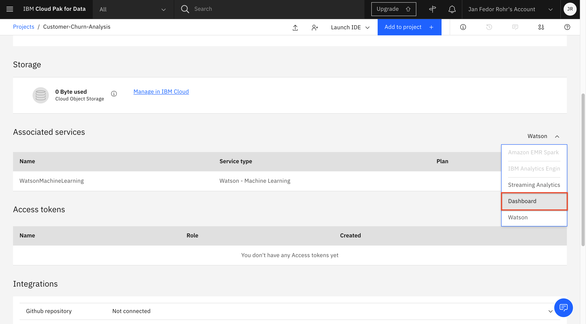

## Data visualization

<h4>1) Upload the data set</h4>

In Watson Studio, select Assets. If not already open, click the 0100 data icon at the upper right of the panel to open the Files sub-panel. Then, click Load and browse the file customer-churn-analysis-V2.csv.

After completing the steps to setting up your environment, you can now focus on the main topic of this tutorial, which is all about data. You’ll learn how to visualize it, then prepare and transform it so that it can be used to build optimized high-quality predictive models.

<h4>2) Preview data in Watson Studio</h4>

After data is collected, the next step is referred to as the data understanding phase. This consists of activities that enable you to become familiar with the data, identify data quality problems, and discover first insights into the data.

You can achieve this in Watson Studio by simple user interactions, without a single line of code. To view the data set in Watson Studio, locate the data asset and then click the name of the data set to open it.

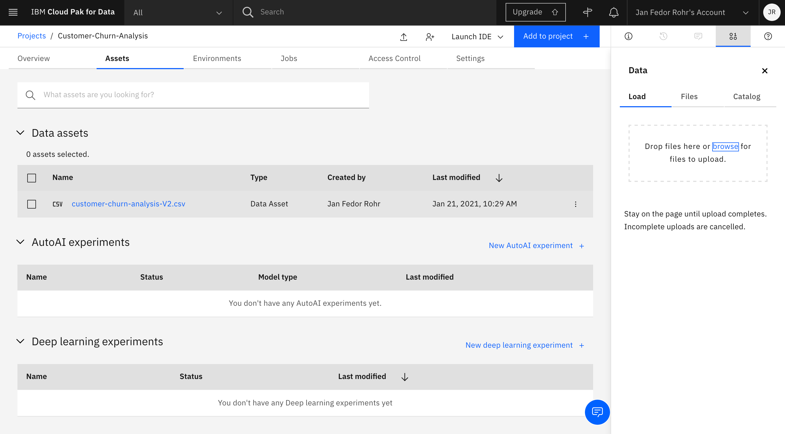

Watson Studio shows you a preview of the data in the Preview tab.

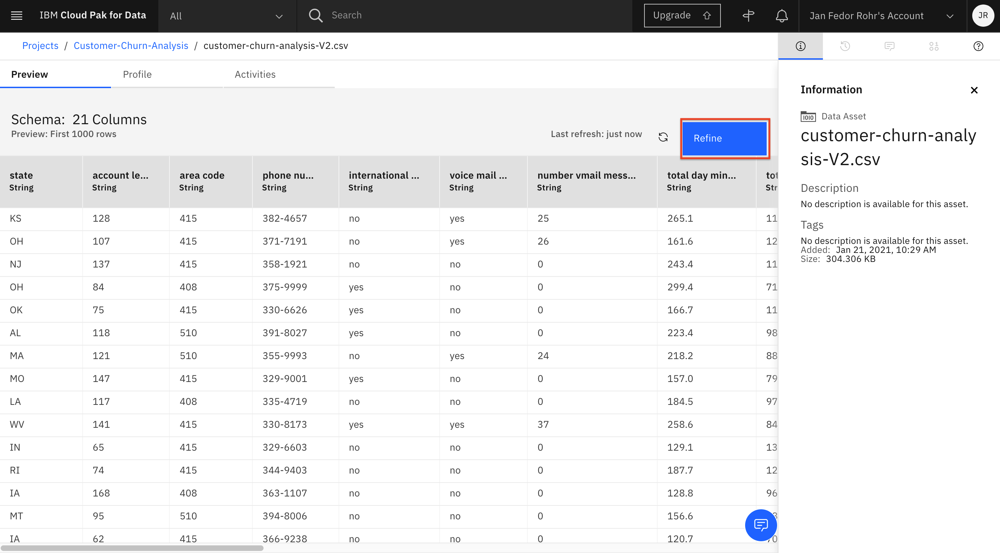

<h4>3) Visualize data in Cognos Dashboard service</h4>

You can look further into the data set by creating a dashboard with associated visualizations. This basically requires three steps: creating an empty dashboard, adding a data source to be used for visualizations, and adding appropriate visualizations to the dashboard.

To create the dashboard:

1. Go to the project and click Add to project.
2. Click Dashboard to create a new (blank) dashboard.
3. Follow these steps in the New Dashboard page:
- Enter a Name for the dashboard (for example, ‘customer-churn-dashboard’.)
- Provide a Description for the dashboard (optional).
- For Cognos Dashboard Embedded Service, select the dashboard service that you created previously and click Create.

4. On the next page, select the Tabbed Freeform (empty) template.
5. Keep the default setting that creates a Tabbed dashboard.
6. Click OK to create an empty freeform dashboard with a single Tab.

To add a data connection:

1. Click the Add a source button (the + icon) in the upper-left part of the page under selected sources:

2. Go to Data Assets and select your customer-churn-analysis-V2.csv file as a data source.
3. Click on the newly imported data source.
4. Preview the data source by clicking pulling up the lower-right of the panel.

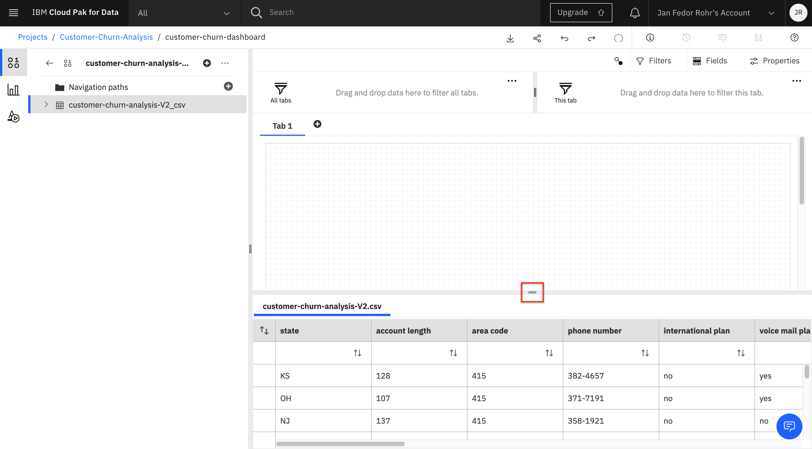

5. Expand the data source by clicking > so that you can view the columns.

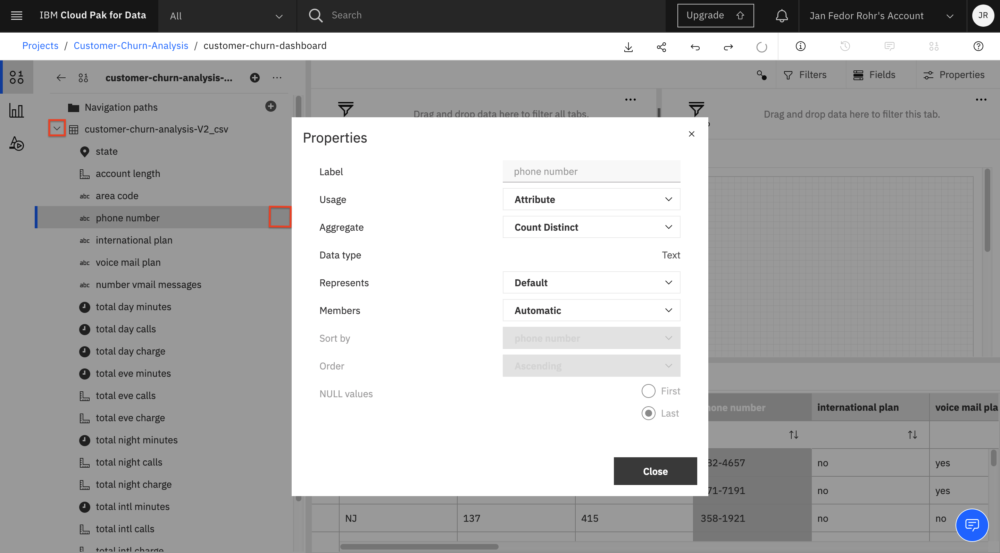

Notice that you can view and change the properties of the columns. Simply click the 3 dots to the right of the column name, then select Properties in the pop-up menu. This displays a window as shown above, and allows you to alter the default setting for Usage (Identifier, Attribute, and Measure) and Aggregate Function (Count, Count Distinct, Maximum, and Minimum). For now, you should be fine with the default settings.

To create a visualization that shows the distribution of churns and no-churns as a pie chart:

1. Select the Visualizations icon in the toolbar to the left.
2. Select a Pie chart.
3. This creates a form for specifying the properties of the pie chart using, for example, columns of the data set.

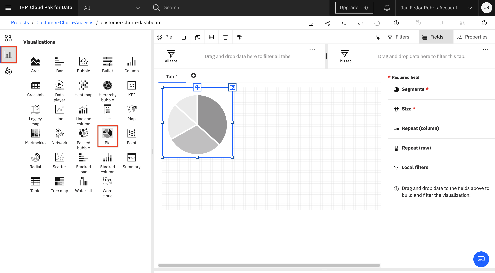

4. Select the Sources icon in the toolbar to the left (located above the Visualizations icon).
5. Drag the churn column onto the Segments property of the pie chart.
6. Drag the churn column onto the Size column of the pie chart.

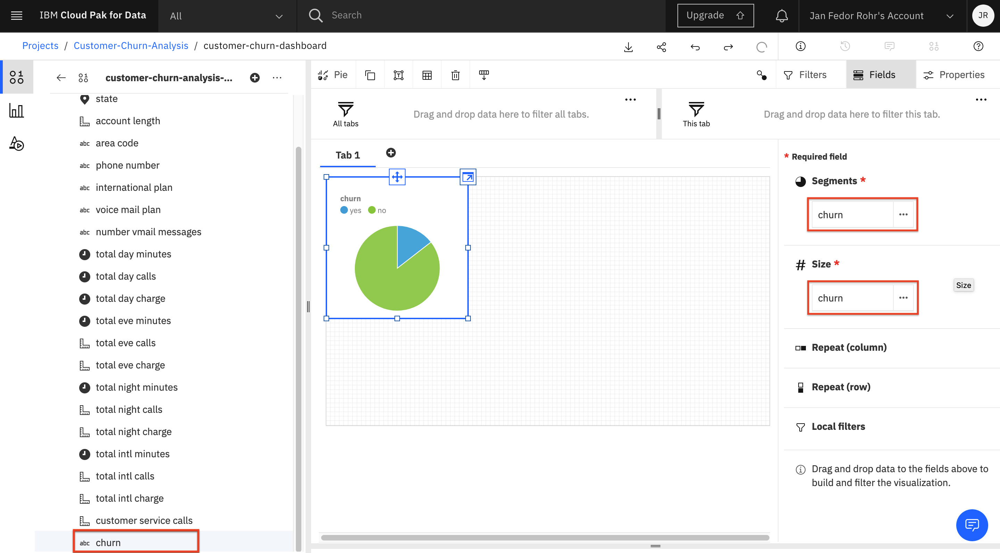

7. Click the Collapse arrow in the upper right of the form, as shown above. This minimizes the pie chart and renders it on the dashboard.
8. Select the Tab at the upper left, then click the Edit the title button.

9. Provide a title for the tab by clicking on the (for example, ‘Customer Churn’), then hit Enter.

Follow these steps and create two more visualizations:

- A stacked column chart showing State (drag to Bars) and Churn (drag to Length and Color) on the X and Y axis, respectively
- A pie chart showing the distribution of International Plan (drag International Plan to Segments and Size)

This should result in a dashboard similar to the following image. Notice that you can move visualizations on the dashboard using the <strong>Move widget</strong> command located on the top of each visualization.

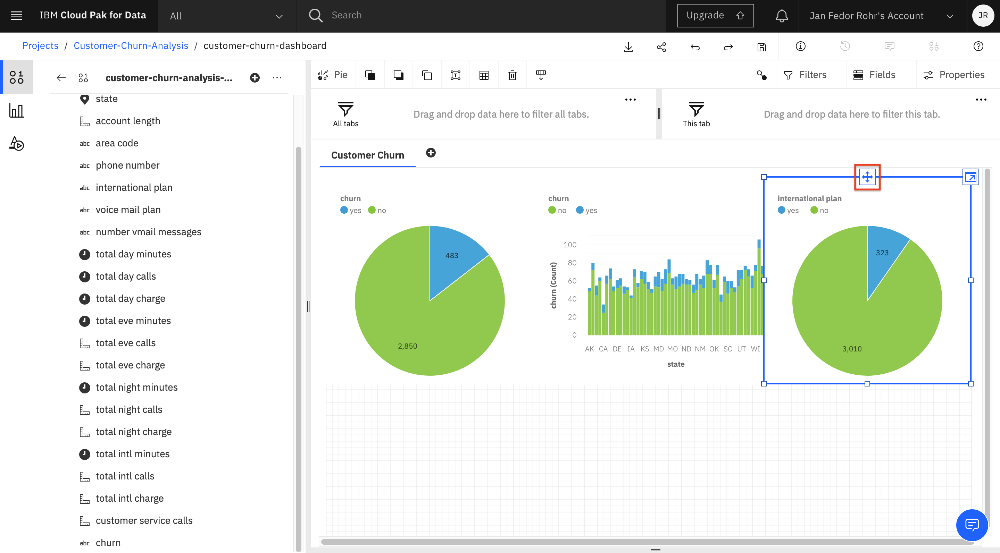

The dashboards are dynamic by nature and support exploration of the data using filters. In the visualization that shows ‘International Plan,’ click the slice associated with the value ‘yes.’ This creates a filter that will apply to all other (connected) visualizations on the current dashboard.

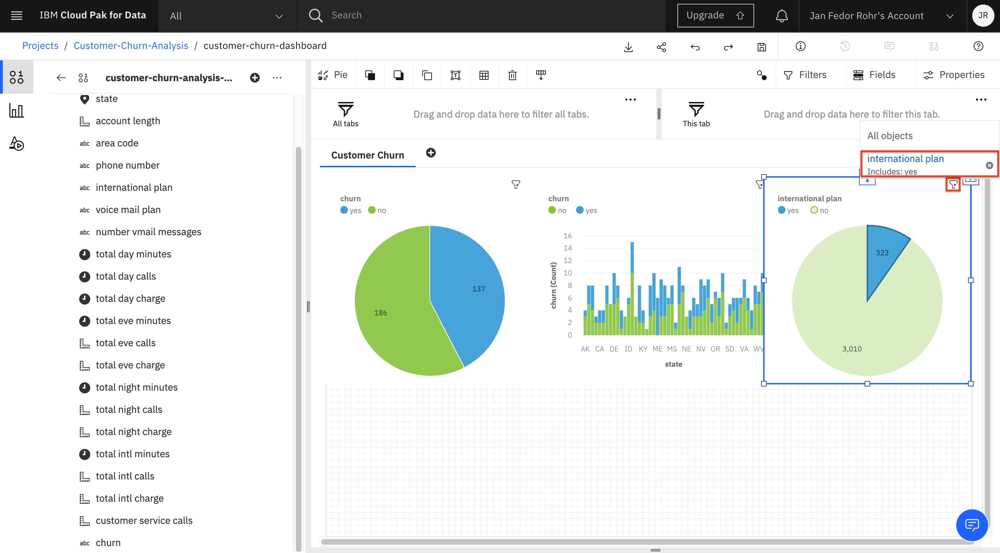

Notice that the slice for churn in the visualization to the left has increased significantly. This tells you that <strong>clients on an international plan are more likely to churn than clients that are not on an international plan</strong>. To remove the filter, click the filter icon for the visualization in the upper-right corner, then select the delete filter button that pops up (the icon is a cross in a circle). Clicking the slice again achieves the same effect.

You can generate a shared link by pressing the share button next to the download button and share your dashboard with others.

## Data preparation and transformation

The data preparation and transformation covers all activities needed to construct the final data set that is fed into the machine learning service. Data preparation tasks are likely to be performed multiple times and not in any prescribed order. Tasks include table, record, and attribute selection as well as transformation and cleansing of data for the modeling tools. This can involve turning categorical features into numerical ones, normalizing the features, and removing columns not relevant for prediction (for example, the phone number of the client).

Watson Studio offers a service called <strong>Data Refine</strong> that lets you clean up and transform data without any programming. To run the service:

1. Click Add to project in the top bar of the project overview page.
2. In the Choose asset type window, select Data Refinery Flow to create a new flow.
3. On the next page, select Data Assets and then the Customer Churn data set and click Add.
4. This opens the data source for you so that you can transform and view it.

The Data Refine service is then loaded and displays the following table.

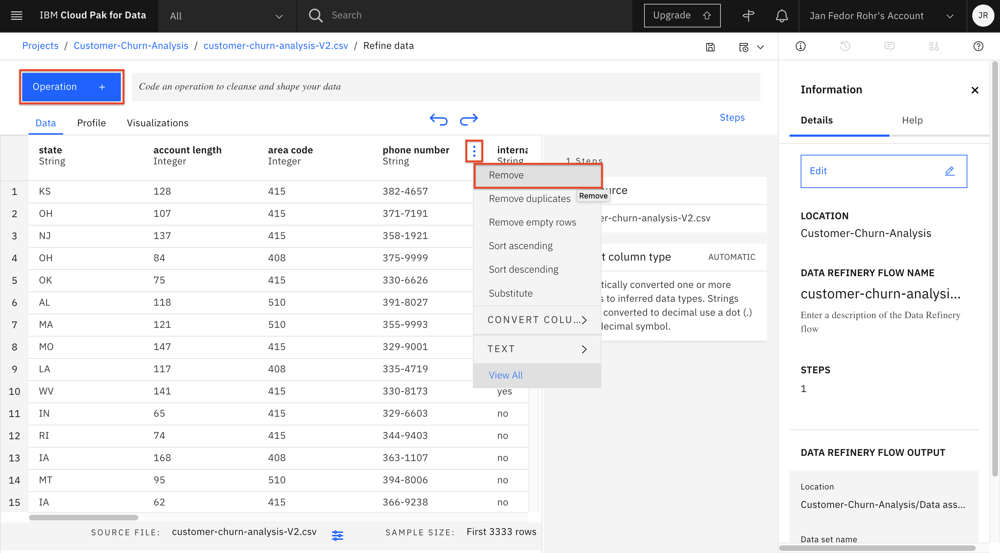

Notice the tabs to the top left, which let you view the data in a tabular form for profiling it (as in the previous section) and for creating custom visualizations of the data.

To transform the data:

1. Select the 3 dots in the “phone number” column and invoke the Remove command in the pull-down menu. This deletes the column.
2. Select one of the columns, for instance state, by clicking on it.
3. Click the Operation button in the upper-left corner, which shows you some available transformations.

You could convert the column to another type (say float or integer). However, we will not do this for now because the Machine Learning service did it for us automatically behind the scenes. But in principle, you could decide to turn a string column into an integer column. This is especially helpful if certain numbers are represented as string, although they are needed as integer or float. Other operations include substitute, remove duplicates or missing values, etc.

1. Select the option to Save and create a job.

2. On the next page, you can name the flow (for instance 'Data Refinery flow for customer churn') and give it an optional description. Note that the output file will be named the same as the asset name, but with an added 'shaped' suffix. You will have to click the Next button, keep the default environment and don't activate schedule.
3. Click Create and run.

Go back to your project and check that the output file and the flow are now part of your project assets. If you click on the newly created flow asset, you see that the “phone number” column has been removed.

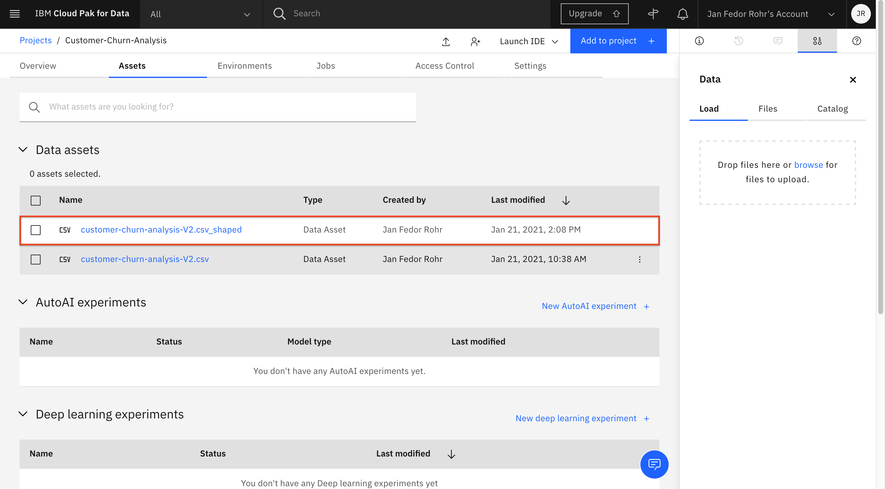

## If you have any questions just contact me
Felix Augenstein 
Digital Tech Ecosystem & Developer Representative @IBM 
Twitter: [@F_Augenstein](https://twitter.com/F_Augenstein) 
LinkedIn: [linkedin.com/in/felixaugenstein](https://www.linkedin.com/in/felixaugenstein/)
